<!-- Generated by scripts/build.mjs from scripts/data.mjs. Edit those, then run: node scripts/build.mjs -->

<a href="https://bishnuprasadkar.vercel.app"></a>

 

<picture><source media="(prefers-color-scheme: dark)" srcset="assets/currently-dark.svg">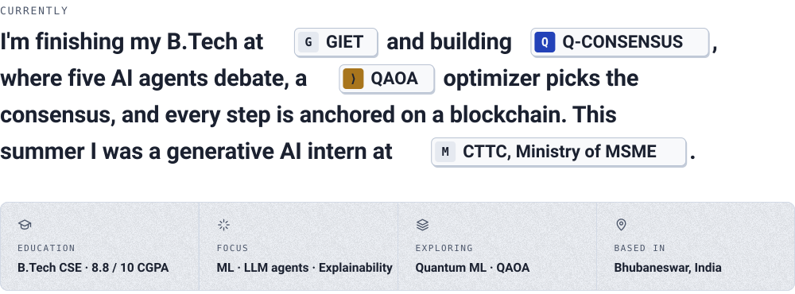</picture>

  

<a href="https://bishnuprasadkar.vercel.app/#work"><picture><source media="(prefers-color-scheme: dark)" srcset="assets/head-work-dark.svg">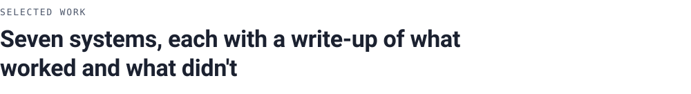</picture></a>

<a href="https://bishnuprasadkar.vercel.app/work/q-consensus"><picture><source media="(prefers-color-scheme: dark)" srcset="assets/work-q-consensus-dark.svg"></picture></a><a href="https://bishnuprasadkar.vercel.app/work/qubitscope"><picture><source media="(prefers-color-scheme: dark)" srcset="assets/work-qubitscope-dark.svg"></picture></a>

<a href="https://bishnuprasadkar.vercel.app/work/misinformation-vaccine"><picture><source media="(prefers-color-scheme: dark)" srcset="assets/work-misinformation-vaccine-dark.svg"></picture></a><a href="https://bishnuprasadkar.vercel.app/work/floodwatch"><picture><source media="(prefers-color-scheme: dark)" srcset="assets/work-floodwatch-dark.svg"></picture></a>

<a href="https://bishnuprasadkar.vercel.app/work/soil-to-shelf"><picture><source media="(prefers-color-scheme: dark)" srcset="assets/work-soil-to-shelf-dark.svg"></picture></a><a href="https://bishnuprasadkar.vercel.app/work/cyclesense"><picture><source media="(prefers-color-scheme: dark)" srcset="assets/work-cyclesense-dark.svg"></picture></a><a href="https://bishnuprasadkar.vercel.app/work/shelfsight"><picture><source media="(prefers-color-scheme: dark)" srcset="assets/work-shelfsight-dark.svg"></picture></a>

<a href="https://bishnuprasadkar.vercel.app/resume.pdf"><picture><source media="(prefers-color-scheme: dark)" srcset="assets/tile-resume-dark.svg"></picture></a><a href="https://bishnuprasadkar.vercel.app"><picture><source media="(prefers-color-scheme: dark)" srcset="assets/tile-portfolio-dark.svg"></picture></a><a href="https://bishnuprasadkar.vercel.app/#research"><picture><source media="(prefers-color-scheme: dark)" srcset="assets/tile-papers-dark.svg">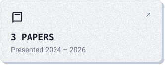</picture></a>

 

<a href="https://bishnuprasadkar.vercel.app/#journey"><picture><source media="(prefers-color-scheme: dark)" srcset="assets/head-journey-dark.svg"></picture></a>

<b>From a hardware paper to multi-agent systems in three years</b> · show all 15 milestones

 

<picture><source media="(prefers-color-scheme: dark)" srcset="assets/journey-dark.svg">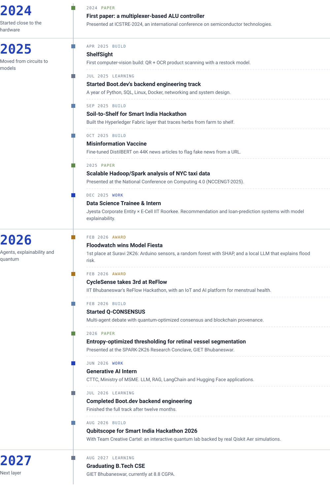</picture>

  

<a href="https://bishnuprasadkar.vercel.app/#research"><picture><source media="(prefers-color-scheme: dark)" srcset="assets/head-trail-dark.svg"></picture></a>

<picture><source media="(prefers-color-scheme: dark)" srcset="assets/experience-dark.svg">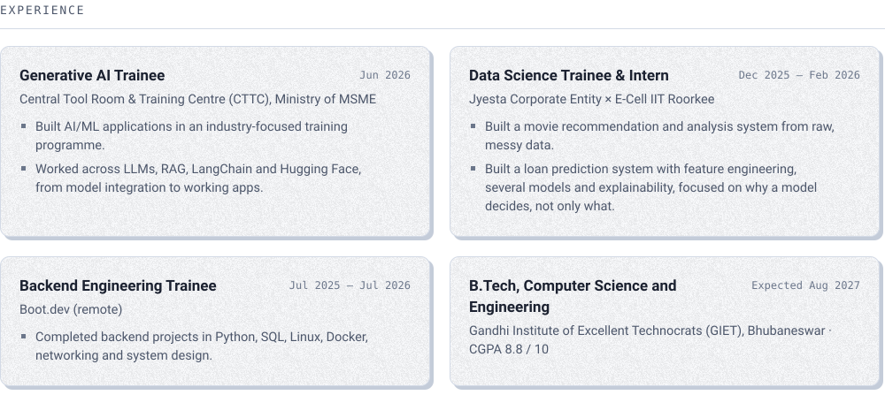</picture>

 

<picture><source media="(prefers-color-scheme: dark)" srcset="assets/papers-dark.svg">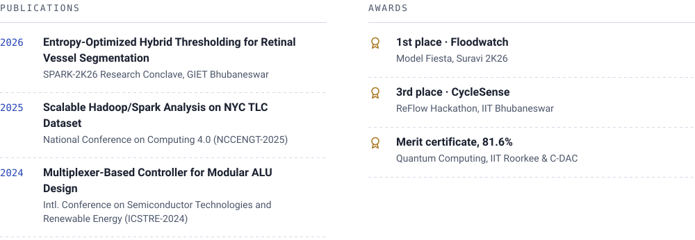</picture>

<a href="https://bishnuprasadkar.vercel.app/certificates/nvidia-deep-learning.pdf"><picture><source media="(prefers-color-scheme: dark)" srcset="assets/cert-nvidia-dark.svg">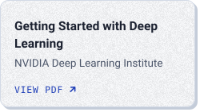</picture></a><a href="https://bishnuprasadkar.vercel.app/certificates/cs50-ai.pdf"><picture><source media="(prefers-color-scheme: dark)" srcset="assets/cert-cs50-dark.svg">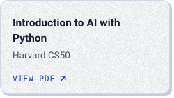</picture></a><a href="https://bishnuprasadkar.vercel.app/certificates/microsoft-genai.pdf"><picture><source media="(prefers-color-scheme: dark)" srcset="assets/cert-microsoft-dark.svg">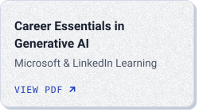</picture></a><a href="https://bishnuprasadkar.vercel.app/certificates/quantum-computing.pdf"><picture><source media="(prefers-color-scheme: dark)" srcset="assets/cert-quantum-dark.svg">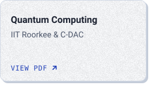</picture></a>

 

<picture><source media="(prefers-color-scheme: dark)" srcset="assets/toolbox-dark.svg">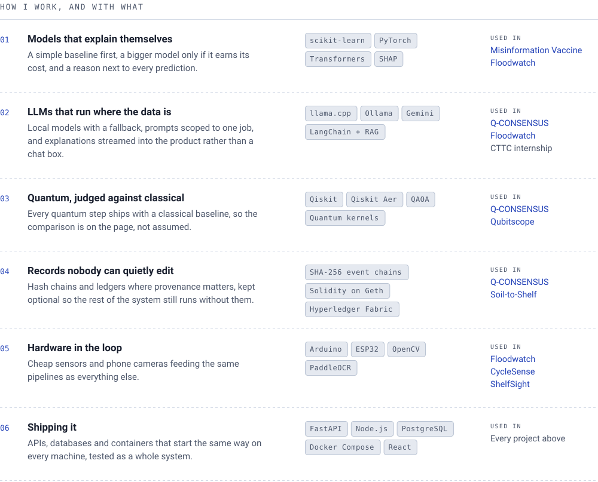</picture>

  

<picture><source media="(prefers-color-scheme: dark)" srcset="assets/head-activity-dark.svg"></picture>

<picture><source media="(prefers-color-scheme: dark)" srcset="assets/stats-dark.svg">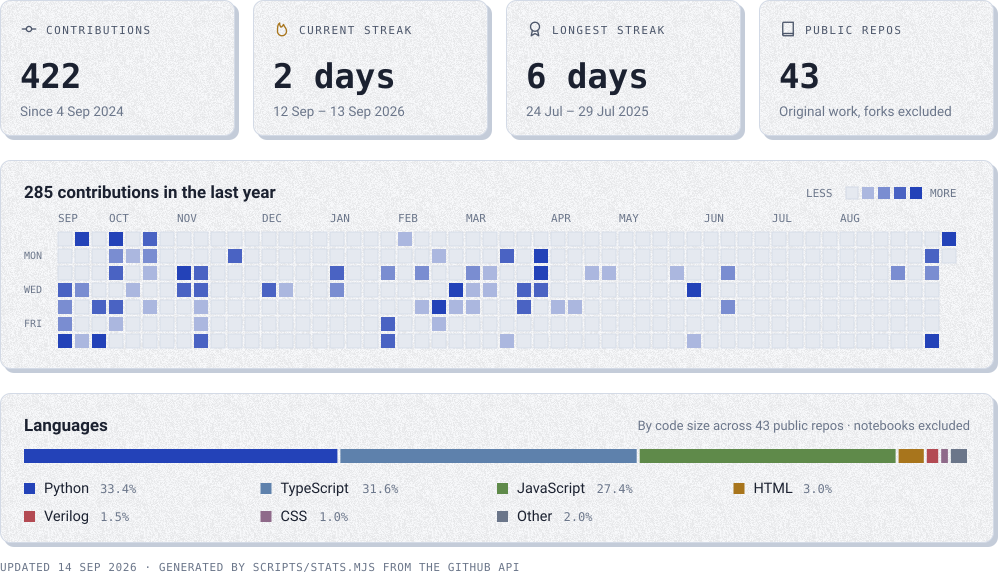</picture>

  

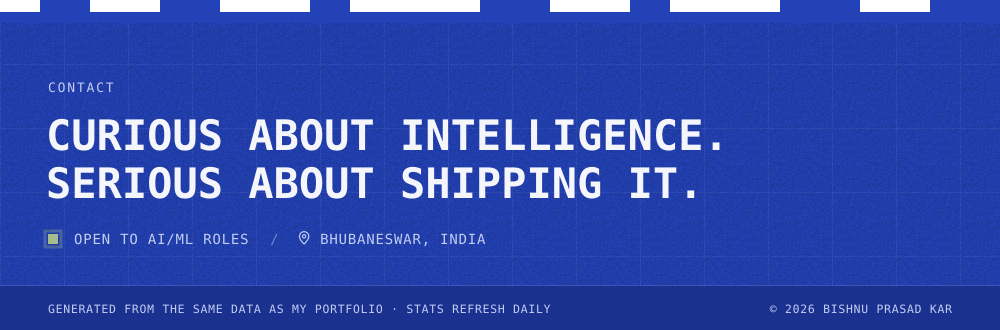

